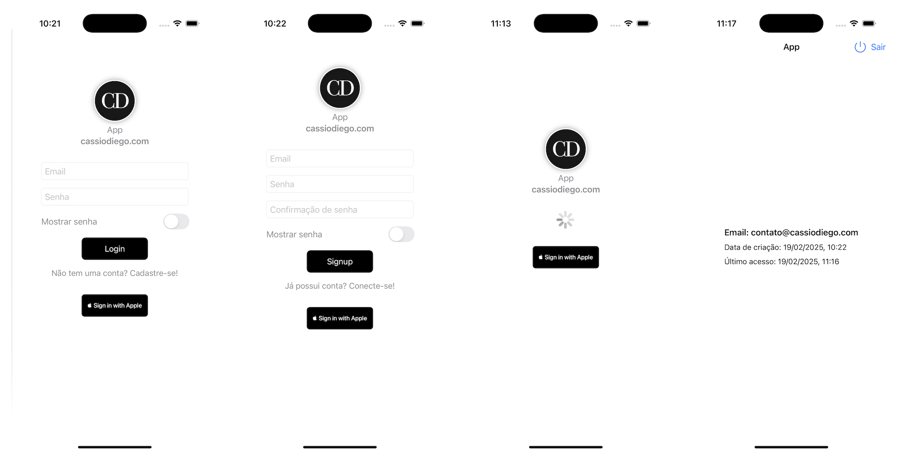

# Firebase Authentication Template App

This is a template application demonstrating how to integrate Firebase Authentication into an iOS app using Swift. Follow the instructions below to set up Firebase, add the required configuration file, and enable authentication.



## Prerequisites

- Xcode 12 or later
- A Firebase account

## Setup Instructions

### Step 1: Create a Firebase Project

1. Go to the [Firebase Console](https://console.firebase.google.com/).
2. Click on the **Add project** button.
3. Enter a project name and click **Continue**.
4. (Optional) Set up Google Analytics for your Firebase project, then click **Continue**.
5. Follow the remaining setup steps and click **Create project**.

### Step 2: Add an iOS App to Your Firebase Project

1. In the Firebase Console, click on the **iOS** icon to add a new iOS app.
2. Enter your app’s **iOS bundle ID**. This should match the `Bundle Identifier` in your Xcode project (e.g., `com.yourcompany.yourapp`).
3. (Optional) Enter other app details like the **App nickname** and the **App Store ID**, then click **Register app**.

### Step 3: Download the `GoogleService-Info.plist` File

1. After registering the app, click **Download GoogleService-Info.plist** to obtain your Firebase iOS config file.
2. In Xcode, right-click on the `Resources` folder in your project and select **Add Files to "Your Project"**.
3. Add the `GoogleService-Info.plist` file you downloaded.

### Step 4: Add Firebase SDK to Your App Using Swift Package Manager

1. Open your Xcode project.
2. Select your project in the Project Navigator, then select your app target.
3. Go to the **Swift Packages** tab.
4. Click the **+** button to add a package dependency.
5. Enter the Firebase SDK repository URL: `https://github.com/firebase/firebase-ios-sdk`.
6. Choose the version rule (e.g., Up to Next Major Version) and click **Next**.
7. Select the Firebase products you need (e.g., `FirebaseAuth`) and click **Finish**.

### Step 5: Configure Firebase in Your App

1. Open your `AppDelegate.swift` file and import the Firebase module at the top:

    ```swift
    import Firebase
    ```

2. Configure Firebase in the `application(_:didFinishLaunchingWithOptions:)` method:

    ```swift
    func application(_ application: UIApplication,
                     didFinishLaunchingWithOptions launchOptions: [UIApplication.LaunchOptionsKey: Any]?) -> Bool {
        FirebaseApp.configure()
        return true
    }
    ```

### Step 6: Enable Authentication in Firebase

1. In the Firebase Console, navigate to **Authentication** in the left-hand menu.
2. Click **Sign-in method**.
3. Enable the desired authentication methods (e.g., Email/Password, Google, Apple, etc.).
4. Follow the setup steps for each authentication method you enable.

### Step 7: Run Your App

1. Build and run your app in Xcode.
2. You should now be able to sign up and log in using the authentication methods you enabled.

## Additional Resources
- [Coordinator](https://github.com/cassiodiego/coordinator)
- [Networking](https://github.com/cassiodiego/networking)
- [Notification](https://github.com/cassiodiego/notification)
- [Parser](https://github.com/cassiodiego/parser)

## Additional Documentation
- [Firebase Documentation](https://firebase.google.com/docs/ios/setup)
- [Firebase Authentication Documentation](https://firebase.google.com/docs/auth/ios/start)

## License

This project is licensed under the MIT License. See the [LICENSE](LICENSE) file for details.
